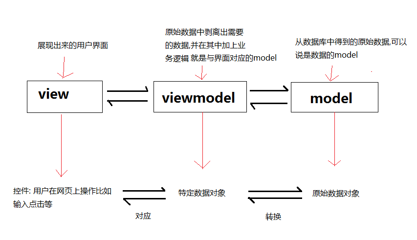

###MVVM

>为了说明得清晰, 先说说服务端渲染的网页, 因为很清楚, 那是 MVC
有这样一个需求: 要做一个页面, 访问显示一个列表, 每个列表一个数字, 数字大于 100 标成红色
写代码时一般这么干: 数据库存储列表和数字, 渲染界面时进行判断,
最后返回的 HTML 当中. 红色的标签会有个 class 比如说 number-red.
这样问题就解决了.. 这里有 Model 和 View, 很清楚

>到了 MVVM, 一般是前端大的场景, 可能会有很多 DOM 操作, 但是实际开发应该尽量避免手动 DOM 操作.
于是用 MVVM 模式把 DOM 变成声明式的, 比如说用一个数据结构 X 来代表 DOM,
然后想要修改 DOM 的时候, 直接修改 X, 然后 DOM 就自动更新了.. 非常方便
当然, 只有在复杂的应用里才要搞这么结构.. 这个复杂的结构也有 Model View 之类东西.

>但是第二个场景是有点问题的, 比如说, 我们把前面的 Model 拿过来直接用行不行?
不行, 前面的 number-red 是我们计算出来的, 在 Model 上没有,
如果我们把这个 number-red 存进数据库, 那设计数据库就显得失败了, 数据重复了
于是, 一个做法就是设立的数据结构 X 是单独的结构, 包含 Model, 也包含 number-red
于是这个 X 基本上就等于是 ViewModel 了...

所以`viewmodel`的作用就是从`model`中得到需要的数据,改造成`view`层所需的特定数据对象格式,并且按照业务需求修改数据(比如以上所说把数字大于100的标记红色);如需操作dom,那么在此处有虚拟dom操作

####参考链接
[https://segmentfault.com/q/1010000000534091](https://segmentfault.com/q/1010000000534091)